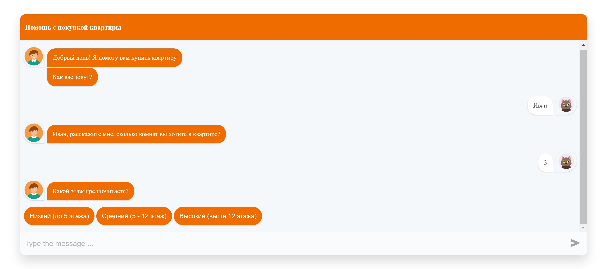

# Simple-Chat-bot

Train creating simple chat bot with **react-simple-chatbot**:

- add custom avatars;
- add custom styles to root chatbot component;
- use previous value in message (use name that was added by user);
- add validation to user name and number of rooms;
- add option values to choose (floor values);
- add custom component as a message (table with user choices)
